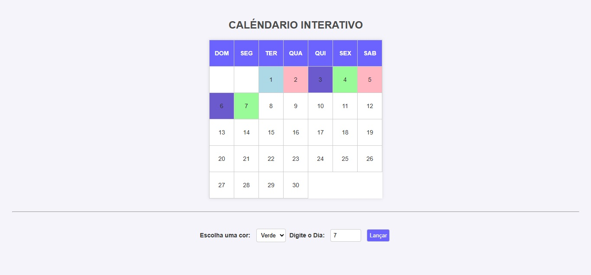

# 📅 Calendário Interativo

Este é um projeto de **Calendário Interativo** desenvolvido com **HTML**, **CSS** e **JavaScript**. Nele, o usuário pode selecionar uma data e aplicar uma cor personalizada para destacar o dia desejado no calendário.

## 🛠 Linguagens de programação

 **HTML5** – estrutura da página
 **CSS** – estilização e layout visual
 **JavaScript** – lógica para selecionar e colorir os dias

 ## 🎯 Funcionalidades

- Exibição de um calendário mensal simples.
- Seleção de uma cor através de um menu suspenso.
- Entrada de um número de 1 a 30 para representar o dia.
- Botão para aplicar a cor selecionada ao dia desejado.

## 📸 Preview

## Autor

 Deivid Galindo